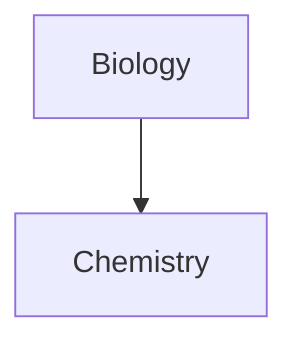
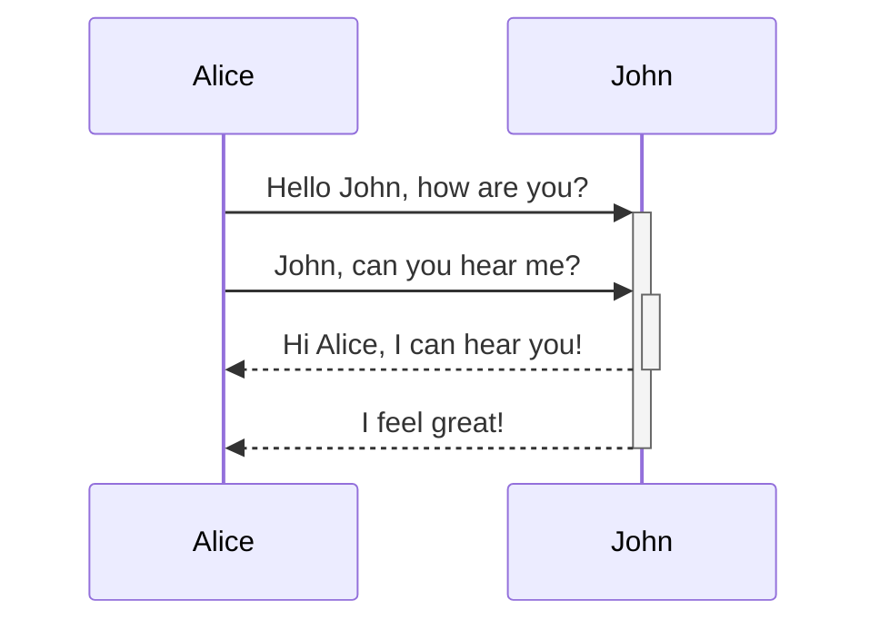

# Code Examples

^320c8d

```python
x = 3
if x < 3:
	print("HELLO WORLD")
else:
	print("NO WORLD")
```


```java
public static void main (String args[])
{
	System.out.println("HELLO WORLD");
}

```

# IFrame Example

<iframe border=0 frameborder=0 height=250 width=550 src="https://www.businessinsider.com/video-russian-bomber-catches-fire-before-crashing-into-residential-building-2022-10"> </iframe> 


# Tables

| Test |   ![[Test.svg|300]]    |
| ---- | ------------------ |
| yup  | Test something ojt |
| nope     |                    |


Press Command on Link below to view preview
[[(Organize) Tools]]


# Call Out

>[!BUG]
>Try again Tasks $nice$

^7a57bd


---

 Run this slideshow to make it work

---
 
that......

---
Looks good
# CheckBoxes

- [ ] Letter Format
- [ ] Accessible across Windows, Android, Mac, and IOS


- [ ] That is pretty cool honestly :) 


- OneNote
	- [x] Letter Format
	- [x] Acessible across devices

# Footnotes

You can create footnotes like this [^1].

# Tags
You can create tags such as long as they're not numeric

[^1]: This is cool





`code block is pretty cool`

query
```query 
#sorting 
```

Callout in detail

> [!info] Example
> Adding a reference here ^[https://www.markdownguide.org/extended-syntax/#fenced-code-blocks]
>- This is really cool
>- Ternary Operator [[(Organize) Tools#^323f5d|Exampple]]
>	``` python
>	print("hello world")
>	```
> 	- really
> 		- ``` python
> 		print("bullet note)
> 		- Next


>[!info] Hello
> test 

^323f5d


